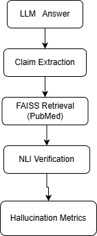
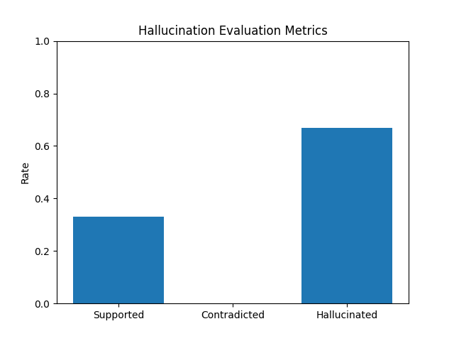

# Detecting Hallucinations in Medical Large Language Models

## Overview
Large Language Models (LLMs) are increasingly used in medical research and clinical decision support. 
However, hallucinated outputs — fluent but unsupported or incorrect claims — pose serious risks in healthcare.

This project proposes an **evidence-grounded pipeline** to detect hallucinations in medical LLM outputs using:
- PubMed-based retrieval
- Claim-level decomposition
- Natural Language Inference (NLI) verification
- Quantitative evaluation metrics

---

## System Pipeline



**Pipeline stages:**
1. PubMed ingestion (real biomedical literature)
2. Semantic retrieval using FAISS
3. Claim extraction from LLM answers
4. NLI-based verification (supported / contradicted / unsupported)
5. Aggregated hallucination metrics

---

## Hallucination Detection Strategy

Each LLM answer is decomposed into atomic claims.
For each claim:
- Relevant PubMed abstracts are retrieved
- Claims are verified using an NLI model (`bart-large-mnli`)
- Claims are labeled as:
  - **Supported**
  - **Contradicted**
  - **Unsupported (hallucination)**

This conservative strategy prioritizes **patient safety** by avoiding false support.

---

## Evaluation Metrics

We evaluate hallucination behavior using:

- **Support Rate**
- **Contradiction Rate**
- **Hallucination Rate**



Example output:
```text
support_rate: 0.33
contradiction_rate: 0.00
hallucination_rate: 0.67
